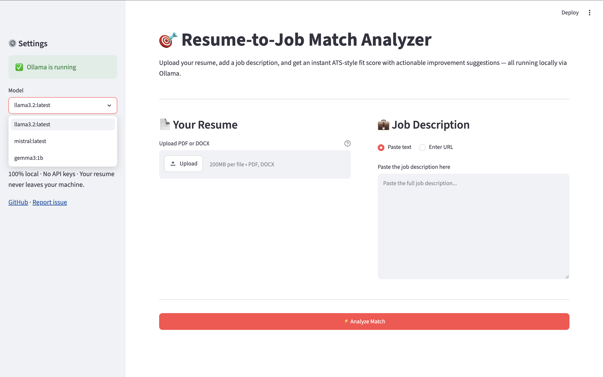
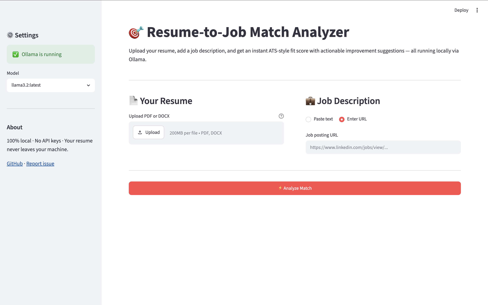
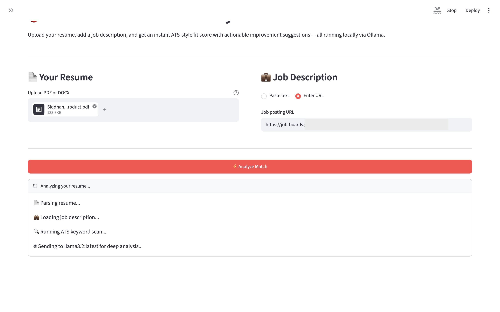
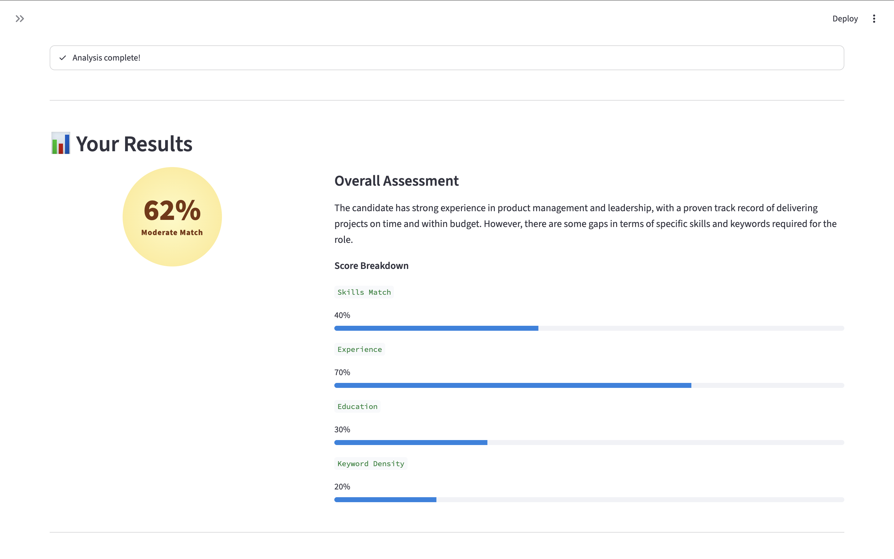
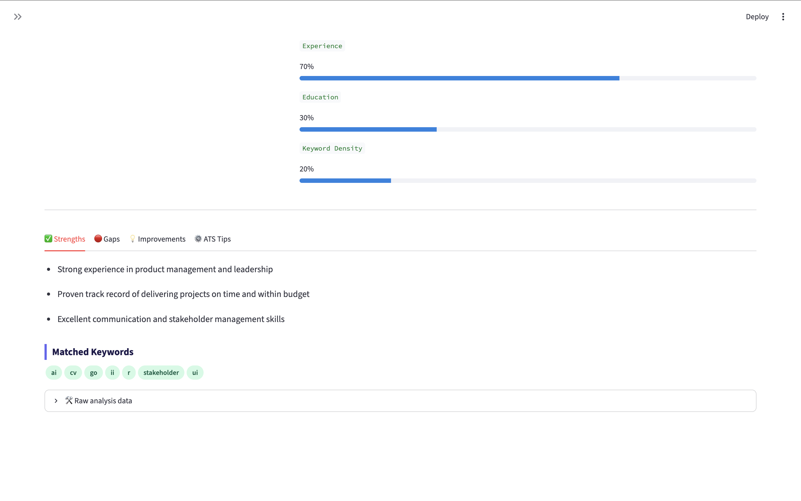
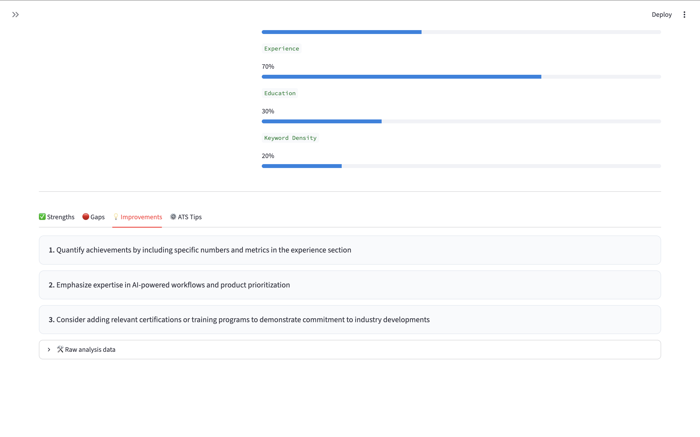
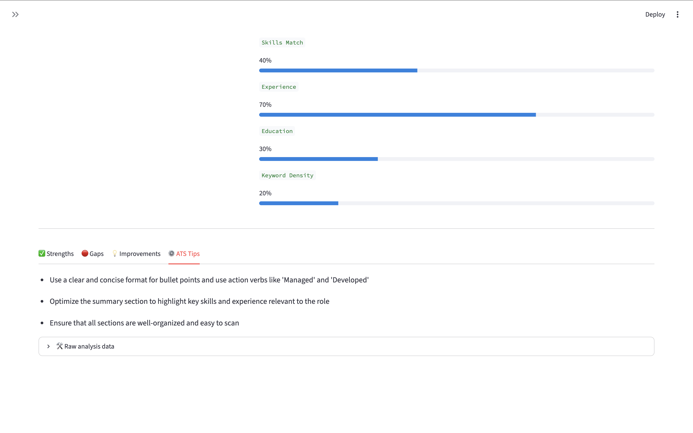

# 🎯 Resume-to-Job Match Analyzer

> AI-powered resume analyzer that scores your fit against any job description — runs entirely on your machine via Ollama.

---

## What It Does

Upload your resume. Paste a job description (or drop a URL). Get an instant, ATS-style breakdown of how well you match — and exactly what to fix.

100% local. No API keys. No data leaving your machine.

---

## Core Outputs

| Output | Description |
|---|---|
| **Fit Score (0–100%)** | ATS + semantic compatibility score |
| **Strengths Analysis** | Matched skills, experience, and achievements |
| **Gap Report** | Missing keywords, certifications, and skills |
| **Improvement Suggestions** | Actionable, role-specific resume edits |
| **ATS Optimization Tips** | Formatting and keyword density recommendations |

---

## How It Works

```
Resume (PDF/DOCX)  ──┐
                     ├──▶  Parse  ──▶  Ollama (Local LLM)  ──▶  Scored Report
Job Description URL ──┘
  or Paste
```

1. **Parse** — Extracts structured content from resume and JD
2. **Match** — Runs ATS keyword matching + semantic skill alignment
3. **Score** — Generates fit score with category-level breakdown
4. **Report** — Returns prioritized, actionable improvement plan

---

## Tech Stack

| Layer | Tech |
|---|---|
| **Frontend** | Streamlit (MVP) / React |
| **Backend** | Python + FastAPI |
| **AI Layer** | Ollama (local LLM inference) |
| **Recommended Models** | `llama3`, `mistral`, `phi3` |
| **Resume Parsing** | PyMuPDF, pdfplumber, python-docx |
| **JD Scraping** | BeautifulSoup (URL-based input) |
| **Data Processing** | Pandas, NumPy |

---

## Prerequisites

Install and run [Ollama](https://ollama.com) before starting:

```bash
# Install Ollama (macOS/Linux)
curl -fsSL https://ollama.com/install.sh | sh

# Pull a model (pick one)
ollama pull llama3       # recommended
ollama pull mistral      # lighter, faster
ollama pull phi3         # smallest footprint

# Confirm it's running
ollama list
```

---

## Quickstart

```bash
# Install dependencies
pip install -r requirements.txt

# Configure your model (optional — defaults to llama3)
cp .env.example .env
# Edit .env → set OLLAMA_MODEL=llama3

# Run
streamlit run app.py
```

> Ollama must be running locally on `http://localhost:11434` before launching the app.

---

## Screenshots

**Home — paste or URL input, model selector**





**Analysis in progress**



**Results — fit score, overall assessment, and score breakdown**



**Results tabs — Strengths, Improvements, ATS Tips**







---

## Roadmap

- [ ] Multi-resume batch comparison
- [ ] Cover letter generator (role-specific)
- [ ] LinkedIn profile gap analysis
- [ ] Interview prep questions based on gaps

---

## Built By

**Sid** — AI Product Manager | [GitHub](https://github.com/your-username) · [LinkedIn](https://linkedin.com/in/your-profile)

> Part of an open-source AI tooling series for PM and job-seeker workflows.

---

*Local-first. Privacy by default. Your resume never leaves your machine.*
